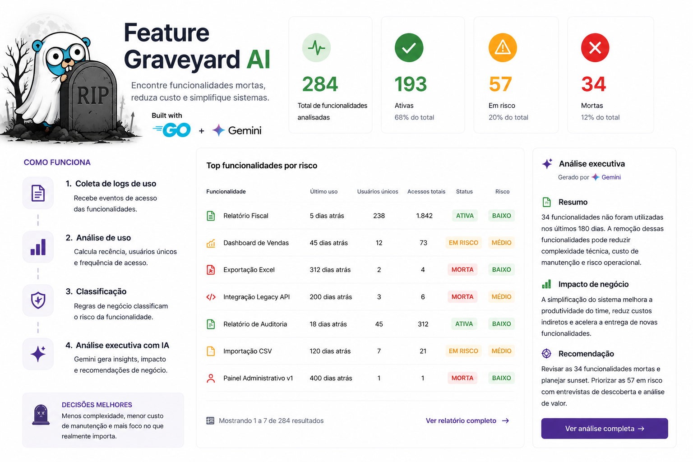

# Feature Graveyard AI

Experimento em Go para identificar funcionalidades mortas ou pouco usadas em sistemas legados e gerar uma analise executiva com Gemini.

O sistema recebe logs de uso, agrupa por funcionalidade, calcula recencia, usuarios unicos, frequencia, risco de remocao e gera recomendacoes de negocio. Quando `GEMINI_API_KEY` esta configurada, a analise executiva vem do Gemini. Sem chave, a aplicacao usa um analisador local deterministico para facilitar demo e testes.



## Rodando

```bash
go run ./cmd/api
```

Acesse `http://localhost:8080`.

Configuracao opcional:

```bash
cp .env.example .env
```

No PowerShell:

```powershell
$env:GEMINI_API_KEY="sua-chave"
$env:GEMINI_MODEL="gemini-1.5-flash"
go run ./cmd/api
```

## API

### Enviar logs

```http
POST /api/usage-logs
Content-Type: application/json
```

```json
{
  "logs": [
    {
      "feature": "RelatorioExportacaoExcel",
      "userId": "123",
      "lastAccess": "2026-01-10",
      "totalAccess": 2
    }
  ]
}
```

### Relatorio

```http
GET /api/graveyard/report?windowDays=180
```

Exemplo de item retornado:

```json
{
  "feature": "RelatorioExportacaoExcel",
  "status": "DEAD_FEATURE",
  "risk": "LOW",
  "summary": "Funcionalidade com baixo uso nos ultimos 180 dias. Pode ser candidata a remocao ou revisao.",
  "businessImpact": "Reduz complexidade do sistema, custo de manutencao e ruido em discovery tecnico."
}
```

## Arquitetura

O projeto segue DDD em camadas simples:

- `internal/domain/feature`: entidades, agregacao e classificacao.
- `internal/application/graveyard`: casos de uso de ingestao e relatorio.
- `internal/infra/ai`: adaptadores de IA, Gemini e fallback local.
- `internal/infra/repository`: persistencia em memoria para demo.
- `internal/infra/http`: handlers REST.
- `web`: dashboard estatico servido pela API Go.

## Testes

```bash
go test ./...
```
